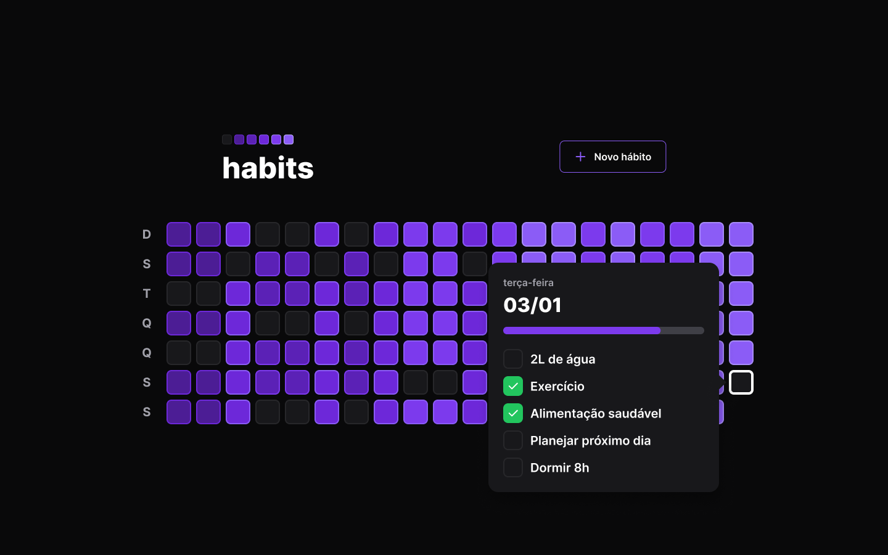
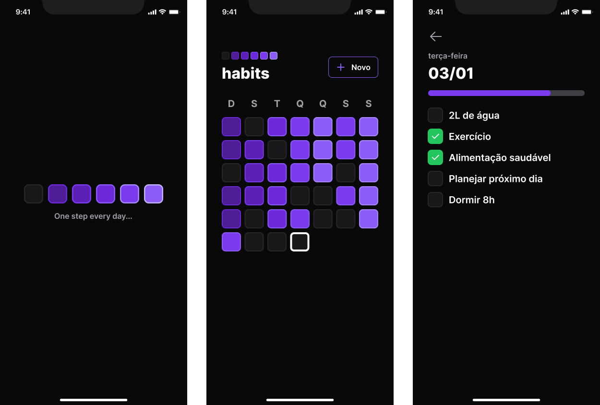
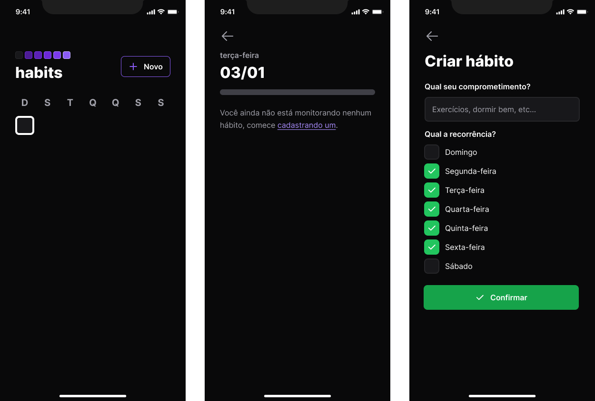

<h1 align="center">  Gestão de Hábitos completa com NodeJs (Back-end), ReactJs (Front-end) e React-Native (Mobile) </h1>

## 📖 Sobre o projeto
O projeto fullstack tratase de um app de monitoramento de hábitos com calendário mostrando hábitos por dia com tonalidades de cores diferentes para identificar a conclusão de hábitos a cada dia. Possibilidade de criação e edição de conclusão de hábitos diariamente.

<h3>💻 Backend: </h3>
<ul>
<li>TypeScript</li>
<li>NodeJS</li>
<li>Fastify</li>
<li>Prisma</li>
<li>SQLite</li>
</ul>

<h3>🌐 Frontend: </h3>
<ul>
<li>TypeScript</li>
<li>ReactJS</li>
<li>Tailwindcss</li>
<li>Vite</li>
<li>Radix</li>
<li>Axios</li>
</ul>

<h3>📱 Mobile:</h3>
<ul>
<li>TypeScript</li>
<li>React Native</li>
<li>Expo</li>
<li>NativeWind</li>
<li>React Native Reanimated</li>
<li>Axios</li>
</ul>

<h2>📌 Funcionalidades</h2>
<ul>
<li>Calendário interativo com identificação de dia atual</li>
<li>Identificação do progresso conclusão de hábitos nos seus dias respectivos</li>
<li>Possibilidade de criação de novos hábitos, selecionado os dias os quais serão realizados</li>
<li>Marcar e desmacar hábitos como concluido</li>
<li>Barra de progresso por dia de acordo com a quantidade de hábitos comcluido seu respectivo dia</li>
</ul>

<h2>🛠️ Tecnologias </h2>

&nbsp;
&nbsp;
&nbsp;
&nbsp;
&nbsp;
&nbsp;
&nbsp;
&nbsp;
&nbsp;
&nbsp;
&nbsp;

